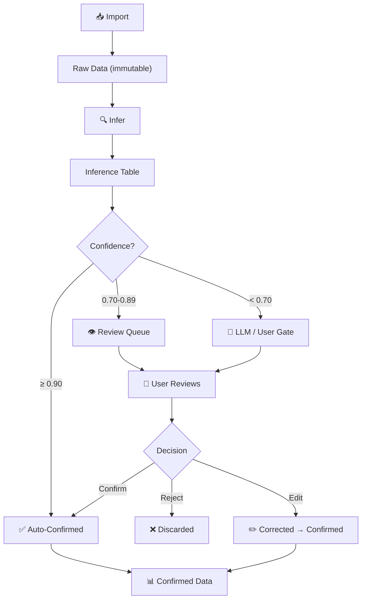
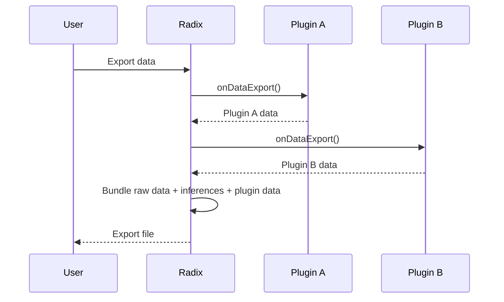
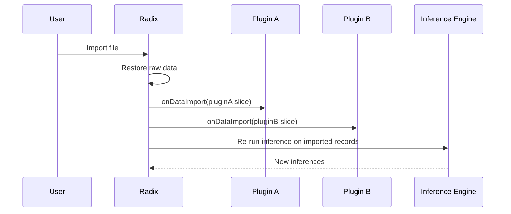

# Data Layer

> PluresDB integration: immutable raw data, inference tables, namespaced collections, and offline-first design.

## Architecture Overview

PluresDB is the persistence layer for radix. It provides a collection-based API where each plugin gets namespaced storage, and the platform manages two special collection types: raw data (immutable) and inferences (mutable, audited).

```
PluresDB
├── raw/                          # Immutable imported data
│   ├── transaction/              # Raw transactions
│   ├── receipt/                  # Raw receipts
│   └── ...
├── inferences/                   # Inference results + decision ledger
│   ├── inference-collection      # All inferences across plugins
│   └── decision-collection       # Decision ledger entries
└── plugins/                      # Per-plugin namespaced collections
    ├── financial-advisor/
    │   ├── accounts
    │   ├── budgets
    │   └── reports
    └── tax-prep/
        ├── forms
        └── deductions
```

## Immutable Raw Data

**Core rule: imported data is never modified after import.**

When data is imported (via `onDataImport` or direct API), it is stored in raw collections. These records are the source of truth — they represent what the user or external system actually provided.

- Records get a stable ID at import time
- No `put()` overwrites on raw data — only initial write
- If data needs correction, the correction is recorded as an inference, not a mutation of the original
- Raw data can be re-exported exactly as imported

This immutability enables:
- Full audit trail (you can always see what was originally imported)
- Safe re-inference (re-run rules against original data after rule updates)
- Data integrity guarantees

## Inference Table

The inference table stores all guesses, predictions, and derived values produced by the inference engine.

```typescript
interface Inference {
  id: string;                    // UUID
  sourceId: string;              // ID of the raw record this infers about
  sourceType: string;            // Type of source record
  field: string;                 // What field was inferred
  value: unknown;                // The inferred value
  confidence: number;            // 0.0-1.0, possibly compound
  strategy: string;              // Rule ID(s), joined with "+" for compounds
  decisionChain: DecisionEntry[];// Full audit trail
  confirmed: boolean;            // User/auto/LLM confirmed
  confirmedBy?: 'user' | 'auto' | 'llm';
  createdAt: string;
  updatedAt: string;
}
```

### Strategy Tags

The `strategy` field tracks which rule(s) produced the inference:
- Single rule: `"fa-category-by-merchant"`
- Compound (multiple rules merged): `"fa-category-by-merchant+fa-category-by-amount-pattern"`
- LLM fallback: `"llm"`

### Decision Chains

Each inference has a `decisionChain` array recording every rule that contributed to it. See [Inference Engine — Decision Ledger](inference-engine.md#decision-ledger) for details.

## Per-Plugin Collections

Plugins access data through the `DataAPI` provided in `PluginContext`:

```typescript
interface DataAPI {
  collection(name: string): CollectionAPI;
}

interface CollectionAPI {
  get(id: string): Promise<unknown>;
  put(id: string, data: unknown): Promise<void>;
  delete(id: string): Promise<void>;
  query(filter?: Record<string, unknown>): Promise<unknown[]>;
  count(): Promise<number>;
}
```

Collections are **automatically namespaced** by plugin ID. When plugin `financial-advisor` calls `data.collection("accounts")`, it operates on the `financial-advisor/accounts` collection. Plugins cannot access each other's collections.

## Data Lifecycle



### Stages

1. **Import** — Raw data enters the system. Stored immutably. Plugin's `onDataImport(data)` is called.
2. **Infer** — The inference engine runs all applicable rules against new records. Results are stored in the inference table.
3. **Review** — Unconfirmed inferences appear in the review queue. Users confirm, reject, or edit.
4. **Confirm** — Confirmed inferences become ground truth. They feed back into future inference runs via `confirmedInferences` in rule input.

## Export/Import Orchestration

### Export



### Import



Each plugin is responsible for its own data slice during import/export. The platform orchestrates the process, calling plugins in dependency order.

## Offline-First, Sync Later

PluresDB operates offline-first:

- **All data is local.** No network required for core operations.
- **Writes are immediate.** No waiting for server confirmation.
- **Sync is deferred.** When connectivity is available, changes are synchronized.
- **Conflict resolution** uses last-write-wins for simple fields, and confidence-aware merging for inferences (higher confidence wins).

This design ensures:
- The app works on planes, in rural areas, anywhere
- Performance is predictable (no network latency in the critical path)
- Data sovereignty — your data lives on your device first
