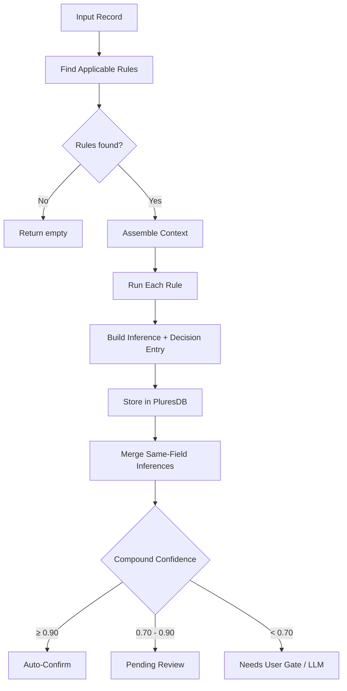
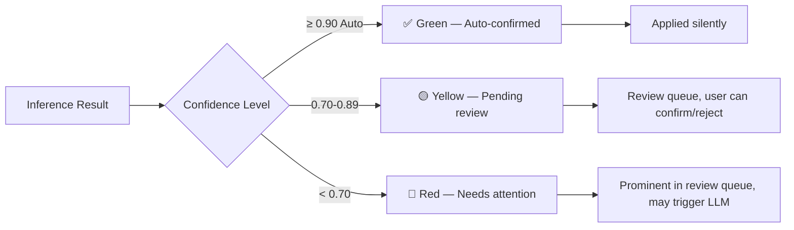

# Inference Engine

> The praxis inference pipeline: deterministic rules with confidence scoring, compound merging, decision ledger, and LLM fallback.

Source: `src/lib/platform/inference-engine.ts`

## Core Principle

**Inference before LLM.** Deterministic rules with quantified confidence run first. LLMs are expensive, non-deterministic fallbacks used only when rule-based confidence is insufficient. Every inference decision is recorded in a ledger for full auditability.

## Rule Anatomy

Each `InferenceRule` follows a consistent structure:

```typescript
interface InferenceRule {
  id: string;                    // Unique rule identifier
  name: string;                  // Human-readable name
  description: string;           // What this rule infers
  appliesTo: string[];           // Source data types (e.g., ["transaction", "receipt"])
  baseConfidence: number;        // Base confidence (0.0-1.0)
  evaluate(input: InferenceInput): InferenceResult | null;
}
```

### Input

The engine assembles context before calling `evaluate()`:

```typescript
interface InferenceInput {
  record: Record<string, unknown>;           // The record being evaluated
  history: Record<string, unknown>[];        // Historical records of same type
  priorInferences: Inference[];              // Previous inferences for this record
  confirmedInferences: Inference[];          // All confirmed inferences (ground truth)
}
```

### Output

Rules return `null` (no inference) or a result:

```typescript
interface InferenceResult {
  field: string;         // What field was inferred
  value: unknown;        // The inferred value
  confidence: number;    // 0.0-1.0
  reasoning: string;     // How the rule reached this conclusion
}
```

## Inference Pipeline



## Compound Confidence Merging

When multiple rules fire for the **same field with the same value** on the same record, their confidence scores are merged using the independent probability formula:

```
compound = 1 - ∏(1 - confidence_i)
```

### Example

Two rules infer `category = "groceries"` for a transaction:
- Rule A: confidence 0.75
- Rule B: confidence 0.60

```
compound = 1 - (1 - 0.75) × (1 - 0.60)
         = 1 - 0.25 × 0.40
         = 1 - 0.10
         = 0.90
```

Individually neither rule would auto-confirm, but together they reach the auto-confirm threshold.

### Implementation

```typescript
function mergeInferences(inferences: Inference[]): Inference[] {
  const byField = new Map<string, Inference[]>();
  for (const inf of inferences) {
    const key = `${inf.sourceId}:${inf.field}:${JSON.stringify(inf.value)}`;
    if (!byField.has(key)) byField.set(key, []);
    byField.get(key)!.push(inf);
  }

  const merged: Inference[] = [];
  for (const [, group] of byField) {
    if (group.length === 1) { merged.push(group[0]); continue; }
    const compound = 1 - group.reduce((acc, inf) => acc * (1 - inf.confidence), 1);
    const primary = group.reduce((a, b) => (a.confidence > b.confidence ? a : b));
    merged.push({
      ...primary,
      confidence: Math.min(1.0, compound),
      strategy: group.map(g => g.strategy).join('+'),
      confirmed: compound >= AUTO_CONFIRM_THRESHOLD,
      confirmedBy: compound >= AUTO_CONFIRM_THRESHOLD ? 'auto' : undefined,
    });
  }
  return merged;
}
```

## Confidence Thresholds

| Threshold | Value | Behavior |
|-----------|-------|----------|
| `AUTO_CONFIRM_THRESHOLD` | **≥ 0.90** | Inference is automatically confirmed. `confirmedBy = 'auto'`. |
| `USER_GATE_THRESHOLD` | **< 0.70** | Inference needs user confirmation. Appears in review queue with prominent call-to-action. |
| *(middle zone)* | **0.70 – 0.89** | Inference is pending. Shown to user but not urgently gated. |

## Decision Ledger

**Every rule firing is recorded.** The decision ledger provides full traceability from raw data to final inference.

```typescript
interface DecisionEntry {
  ruleId: string;                         // Which rule fired
  input: Record<string, unknown>;         // Summarized input (recordId, fieldCount)
  output: unknown;                        // The inferred value
  confidenceDelta: number;                // result.confidence - rule.baseConfidence
  reasoning: string;                      // Human-readable explanation
  timestamp: string;                      // ISO 8601
}
```

### What Gets Recorded

- `ruleId` — Which rule produced this decision
- `input` — A summary of what the rule saw (record ID, field count — not the full record, for storage efficiency)
- `output` — What the rule inferred
- `confidenceDelta` — How much the result deviated from the rule's base confidence (positive = more confident, negative = less)
- `reasoning` — The rule's explanation of its logic
- `timestamp` — When the decision was made

### Querying the Ledger

```typescript
const chain = await inference.getDecisionChain(inferenceId);
// Returns DecisionEntry[] sorted by timestamp
// Shows the full history of how an inference was reached
```

## How Plugins Register Inference Rules

Plugins declare rules in their `RadixPlugin.rules` array:

```typescript
const myPlugin: RadixPlugin = {
  id: 'financial-advisor',
  // ...
  rules: [
    {
      id: 'fa-category-by-merchant',
      name: 'Category by Merchant',
      description: 'Infer transaction category from merchant name',
      appliesTo: ['transaction'],
      baseConfidence: 0.80,
      evaluate(input) {
        const merchant = input.record.merchant as string;
        const category = merchantCategoryMap[merchant];
        if (!category) return null;
        return {
          field: 'category',
          value: category,
          confidence: 0.85,
          reasoning: `Merchant "${merchant}" is mapped to category "${category}"`,
        };
      },
    },
  ],
};
```

At activation, the plugin loader collects rules from all active plugins via `getAllInferenceRules()`. The inference engine filters by `appliesTo` when processing a record.

## Inference → UX Flow



### Color-Coded Confidence in UI

| Confidence | Color | UX Treatment |
|------------|-------|--------------|
| ≥ 0.90 | 🟢 Green | Auto-confirmed, shown as fact with "auto" badge |
| 0.70 – 0.89 | 🟡 Yellow | Shown as suggestion, user can confirm or reject |
| < 0.70 | 🔴 Red | Flagged for review, prominent call-to-action |

### Review Queue

The review queue surfaces all unconfirmed inferences sorted by confidence (lowest first). Users can:
- **Confirm** — marks inference as ground truth, feeds back into future rules
- **Reject** — removes the inference
- **Edit** — correct the inferred value, creating confirmed ground truth

## LLM Fallback

When inference confidence is too low and no deterministic rules can improve it, the engine falls back to the LLM:

1. **Check eligibility**: `llm.available()` and `llm.remainingBudget() > 0`
2. **Assemble context**: The record, relevant historical data, prior inferences, and the specific field needing inference
3. **Query LLM**: `llm.complete(prompt, context)`
4. **Parse response**: Extract field value and confidence from LLM output
5. **Record decision**: LLM inference is recorded in the decision ledger with `strategy: 'llm'`
6. **Mark source**: `confirmedBy: 'llm'` — distinct from user or auto confirmation

The LLM is a **last resort**, not a first choice. Budget tracking prevents runaway costs.

## Inference Data Model

```typescript
interface Inference {
  id: string;                    // UUID
  sourceId: string;              // Record that was evaluated
  sourceType: string;            // Type of source record
  field: string;                 // Field that was inferred
  value: unknown;                // Inferred value
  confidence: number;            // 0.0-1.0
  strategy: string;              // Rule ID(s) that produced this (joined with "+" for compounds)
  decisionChain: DecisionEntry[];// Full decision history
  confirmed: boolean;            // Whether this is confirmed
  confirmedBy?: 'user' | 'auto' | 'llm';
  createdAt: string;             // ISO 8601
  updatedAt: string;             // ISO 8601
}
```
