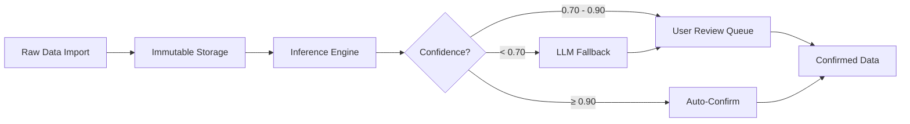
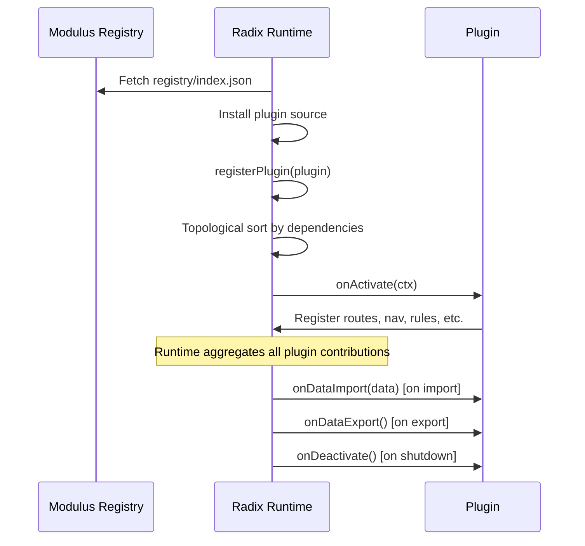

# pares-radix Architecture Overview

> The opinionated application runtime for the Praxis ecosystem.

## Design Philosophy

Radix follows a strict data pipeline: **immutable data → deterministic inference → LLM only where needed**. Every decision is recorded, every confidence score is auditable, and the user always has the final say.

### Core Principles

1. **Immutable Raw Data** — Imported data is never modified. All mutations happen in the inference layer.
2. **Inference Before LLM** — Deterministic rules with confidence scoring run first. LLMs are expensive fallbacks, not defaults.
3. **Full Auditability** — Every rule firing is recorded in a decision ledger with input, output, confidence delta, and reasoning.
4. **No Dead Ends** — UX contracts enforce that every page is reachable, every data prerequisite has a fulfillment path, and every nav item resolves.
5. **Plugin-First** — All domain logic lives in plugins. Radix is the runtime; plugins are the applications.

## High-Level Architecture

```
┌─────────────────────────────────────────────────────────────────┐
│                         pares-radix                             │
│                                                                 │
│  ┌───────────────────────────────────────────────────────────┐  │
│  │                    Svelte UI Shell                        │  │
│  │  ┌─────────┐ ┌──────────┐ ┌──────────┐ ┌─────────────┐  │  │
│  │  │ Sidebar │ │Dashboard │ │ Settings │ │    Help     │  │  │
│  │  │  Nav    │ │ Widgets  │ │  Panel   │ │  Sections   │  │  │
│  │  └────┬────┘ └────┬─────┘ └────┬─────┘ └──────┬──────┘  │  │
│  │       └───────────┴────────────┴───────────────┘          │  │
│  │                    ▲ aggregated from plugins               │  │
│  └───────────────────────────────────────────────────────────┘  │
│                                                                 │
│  ┌───────────────────────────────────────────────────────────┐  │
│  │                   Plugin Loader                           │  │
│  │  register → topological sort → activate in order          │  │
│  │  Aggregates: routes, nav, settings, widgets, help,        │  │
│  │              onboarding, rules, expectations, constraints │  │
│  └───────────────────────────────────────────────────────────┘  │
│                                                                 │
│  ┌──────────────┐  ┌──────────────┐  ┌────────────────────┐   │
│  │  Inference   │  │  UX Contract │  │  Platform Context  │   │
│  │  Engine      │  │  Validator   │  │                    │   │
│  │              │  │              │  │  settings  data    │   │
│  │  rules →     │  │  no dead     │  │  llm    inference  │   │
│  │  confidence  │  │  ends, data  │  │  navigation       │   │
│  │  → ledger    │  │  prereqs,    │  │  notify           │   │
│  │  → merge     │  │  nav resolve │  │                    │   │
│  └──────┬───────┘  └──────────────┘  └────────┬───────────┘   │
│         │                                      │               │
│  ┌──────┴──────────────────────────────────────┴───────────┐   │
│  │                      PluresDB                           │   │
│  │  ┌────────────┐ ┌────────────────┐ ┌────────────────┐  │   │
│  │  │  Raw Data  │ │  Inferences    │ │ Plugin Collections│ │   │
│  │  │ (immutable)│ │ (confidence,   │ │ (namespaced)   │  │   │
│  │  │            │ │  decisions)    │ │                 │  │   │
│  │  └────────────┘ └────────────────┘ └────────────────┘  │   │
│  └─────────────────────────────────────────────────────────┘   │
│                                                                 │
│  ┌─────────────────────────────────────────────────────────┐   │
│  │                   pares-modulus                          │   │
│  │            (external plugin registry)                    │   │
│  │         discover → install → update                      │   │
│  └─────────────────────────────────────────────────────────┘   │
└─────────────────────────────────────────────────────────────────┘
```

## Module Map

| Module | Path | Responsibility |
|--------|------|----------------|
| **Plugin Types** | `src/lib/types/plugin.ts` | `RadixPlugin` interface, all contracts (routes, nav, settings, widgets, help, onboarding, expectations, rules, constraints, lifecycle hooks), platform context APIs |
| **Plugin Loader** | `src/lib/platform/plugin-loader.ts` | Registration, topological dependency sort, activation/deactivation, aggregated registries for routes, nav, settings, widgets, etc. |
| **Inference Engine** | `src/lib/platform/inference-engine.ts` | Rule evaluation, confidence scoring, compound confidence merging, decision ledger, auto-confirmation thresholds |
| **UX Contracts** | `src/lib/praxis/ux-contracts.ts` | Built-in expectations (no dead ends, data prerequisites have empty states, nav items resolve), runtime validation |

## Data Flow



## Plugin Lifecycle



## Related Documentation

- [Plugin System](plugin-system.md) — Plugin contracts, discovery, installation, lifecycle
- [Inference Engine](inference-engine.md) — Rules, confidence, decision ledger, LLM fallback
- [Data Layer](data-layer.md) — PluresDB integration, immutable data, namespaced collections
- [UX Framework](ux-framework.md) — UX contracts, Svelte integration, onboarding, layout
