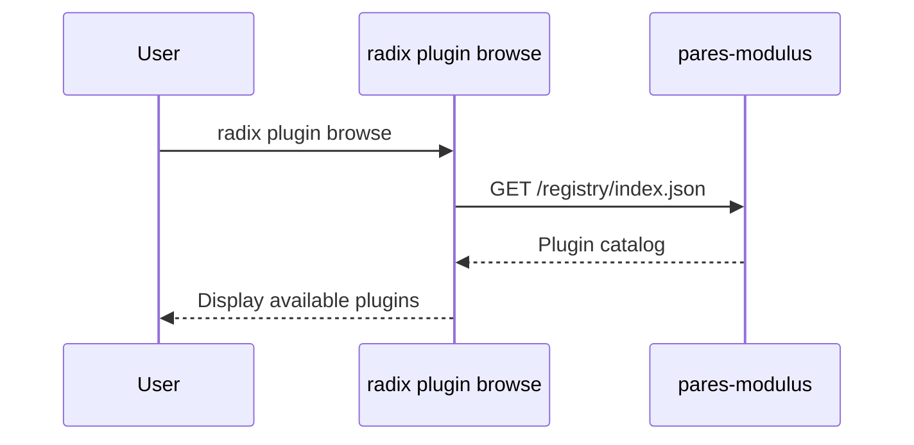

# Plugin System

> How plugins work end-to-end in pares-radix.

## RadixPlugin Interface Contract

Every plugin implements the `RadixPlugin` interface defined in `src/lib/types/plugin.ts`. This is the complete contract between a plugin and the radix runtime.

### Manifest Fields

| Field | Type | Required | Description |
|-------|------|----------|-------------|
| `id` | `string` | ✓ | Unique kebab-case identifier |
| `name` | `string` | ✓ | Human-readable name |
| `version` | `string` | ✓ | SemVer version |
| `icon` | `string` | ✓ | Emoji or icon path |
| `description` | `string` | ✓ | Short description |
| `dependencies` | `string[]` | | Plugin IDs this depends on (loaded first) |

### UI Integration

| Field | Type | Required | Description |
|-------|------|----------|-------------|
| `routes` | `PluginRoute[]` | ✓ | Routes this plugin mounts. Each route has a `path`, lazy `component` loader, optional `title`, and optional `requires` (data prerequisites). Routes are namespaced under `/<plugin-id>/`. |
| `navItems` | `NavItem[]` | ✓ | Sidebar navigation items with `href`, `label`, `icon`, optional `children` and `badge` count. |
| `settings` | `PluginSetting[]` | ✓ | Settings exposed in the unified settings page. Types: `toggle`, `select`, `text`, `number`, `password`, `color`. Keys are namespaced: `"plugin-id.setting-name"`. |
| `dashboardWidgets` | `DashboardWidget[]` | | Dashboard widgets with lazy component, `colspan` (1-4), and `priority` ordering. |
| `helpSections` | `HelpSection[]` | | Help content (markdown string or lazy Svelte component) with priority ordering. |
| `onboardingSteps` | `OnboardingStep[]` | | Ordered steps with `isComplete()` check, `after` dependencies on other plugin steps. |

### Praxis Integration

| Field | Type | Description |
|-------|------|-------------|
| `expectations` | `Expectation[]` | Business/UX/security/performance/inference expectations with `validate()` function. Severity: `error`, `warning`, `info`. |
| `rules` | `InferenceRule[]` | Inference rules with `appliesTo` source types, `baseConfidence`, and `evaluate()` returning field, value, confidence, reasoning. |
| `constraints` | `Constraint[]` | Validation constraints with `validate()` and error `message`. |

### Lifecycle Hooks

```typescript
onActivate?(ctx: PluginContext): Promise<void>   // Plugin activated, receives platform APIs
onDeactivate?(): Promise<void>                    // Plugin deactivated, clean up
onDataImport?(data: unknown): Promise<void>       // Platform importing data, plugin receives its slice
onDataExport?(): Promise<unknown>                 // Platform exporting data, plugin returns its slice
```

### Platform Context (PluginContext)

Passed to `onActivate`, this gives the plugin access to all platform services:

| API | Methods | Purpose |
|-----|---------|---------|
| `settings` | `get(key)`, `set(key, value)`, `subscribe(key, cb)` | Read/write/watch settings |
| `data` | `collection(name)` → `get`, `put`, `delete`, `query`, `count` | PluresDB collections, namespaced to plugin |
| `llm` | `available()`, `complete(prompt, context)`, `remainingBudget()` | LLM integration with budget tracking |
| `inference` | `infer(type, record)`, `getInferences(id)`, `confirm(id, bool)`, `getDecisionChain(id)` | Run inference, review results |
| `navigation` | `goto(href)`, `setBreadcrumbs(crumbs)` | Navigate and set breadcrumbs |
| `notify` | `success(msg)`, `info(msg)`, `warning(msg)`, `error(msg)` | Toast notifications |

## Plugin Discovery from Modulus

[pares-modulus](https://github.com/plures/pares-modulus) is a nixpkgs-style plugin registry. Radix discovers available plugins by fetching the registry index:

```
GET {modulus-url}/registry/index.json
```

The index contains metadata for all available plugins: id, name, version, description, icon, dependencies, and source location.



## Plugin Installation

Installation pulls plugin source from modulus and caches it locally:

1. **Fetch metadata** from modulus registry
2. **Resolve dependencies** — ensure all deps are installed or install them first
3. **Download source** to local plugin cache
4. **Validate** — check that the module exports a valid `RadixPlugin`
5. **Register** — add to local plugin manifest

```
~/.radix/
  plugins/
    financial-advisor/
      index.ts
      package.json
    tax-prep/
      index.ts
      package.json
  plugin-manifest.json     # tracks installed plugins + versions
```

## Plugin Loading and Initialization Order

The plugin loader (`src/lib/platform/plugin-loader.ts`) uses **topological sort** to determine activation order based on declared `dependencies`.

### Algorithm

```typescript
function topologicalSort(plugins: Map<string, LoadedPlugin>): string[] {
  const visited = new Set<string>();
  const sorted: string[] = [];

  function visit(id: string): void {
    if (visited.has(id)) return;
    visited.add(id);
    const entry = plugins.get(id);
    if (!entry) return;
    for (const dep of entry.plugin.dependencies ?? []) {
      if (plugins.has(dep)) visit(dep);
      else console.warn(`Plugin "${id}" depends on "${dep}" which is not registered.`);
    }
    sorted.push(id);
  }

  for (const id of plugins.keys()) visit(id);
  return sorted;
}
```

### Activation Sequence

1. All plugins are **registered** first (no activation yet)
2. `activateAll(ctx)` computes topological order
3. Plugins are activated sequentially — dependencies are guaranteed to be active before dependents
4. Failed activations are logged but don't block other plugins

### Deactivation

Deactivation runs in **reverse** topological order — dependents are deactivated before their dependencies.

## Plugin Isolation and Security Boundaries

- **Data namespacing**: Each plugin's `data.collection(name)` is automatically namespaced by plugin ID. Plugin `financial-advisor` accessing collection `"accounts"` actually accesses `financial-advisor/accounts`.
- **Settings namespacing**: Setting keys are namespaced: `"financial-advisor.currency"`.
- **Route namespacing**: Plugin routes are mounted under `/<plugin-id>/`. A route with `path: "/"` becomes `"/financial-advisor/"`.
- **No cross-plugin data access**: Plugins cannot directly access another plugin's collections. Cross-plugin communication happens through shared inference types or the platform context.
- **LLM budget isolation**: `llm.remainingBudget()` tracks per-session token usage.

## Plugin Update Mechanism

1. `radix plugin update` checks modulus for newer versions
2. Downloads updated source
3. Deactivates the old version
4. Replaces local source
5. Re-registers and re-activates with new version
6. Data migrations (if any) are handled by the plugin's `onActivate` detecting a version change

## CLI Design

| Command | Description |
|---------|-------------|
| `radix plugin browse` | List available plugins from modulus registry |
| `radix plugin install <id>` | Install a plugin (resolves dependencies) |
| `radix plugin update [id]` | Update one or all plugins |
| `radix plugin remove <id>` | Uninstall a plugin (checks dependents first) |
| `radix plugin list` | Show installed plugins with status |

### Example Session

```bash
$ radix plugin browse
┌────────────────────┬─────────┬────────────────────────────────┐
│ ID                 │ Version │ Description                    │
├────────────────────┼─────────┼────────────────────────────────┤
│ financial-advisor  │ 1.2.0   │ Personal finance management    │
│ tax-prep           │ 0.9.1   │ Tax preparation assistant      │
│ budget-tracker     │ 2.0.0   │ Monthly budget tracking        │
└────────────────────┴─────────┴────────────────────────────────┘

$ radix plugin install tax-prep
Installing tax-prep@0.9.1...
  → Dependency: financial-advisor (already installed)
  ✓ Installed tax-prep@0.9.1

$ radix plugin list
┌────────────────────┬─────────┬────────┐
│ ID                 │ Version │ Status │
├────────────────────┼─────────┼────────┤
│ financial-advisor  │ 1.2.0   │ active │
│ tax-prep           │ 0.9.1   │ active │
└────────────────────┴─────────┴────────┘
```

## Aggregated Registries

The plugin loader exposes aggregated views across all active plugins:

| Function | Returns | Notes |
|----------|---------|-------|
| `getAllRoutes()` | `PluginRoute[] + pluginId` | Routes namespaced by plugin ID |
| `getAllNavItems()` | `NavItem[]` | All sidebar items |
| `getAllSettings()` | `PluginSetting[]` | All settings for unified panel |
| `getAllDashboardWidgets()` | `DashboardWidget[]` | Sorted by priority |
| `getAllHelpSections()` | `HelpSection[]` | Sorted by priority |
| `getAllOnboardingSteps()` | `OnboardingStep[]` | Dependency-ordered |
| `getAllInferenceRules()` | `InferenceRule[]` | All rules for inference engine |
| `getAllExpectations()` | `Expectation[]` | All expectations for validation |
| `getAllConstraints()` | `Constraint[]` | All validation constraints |
