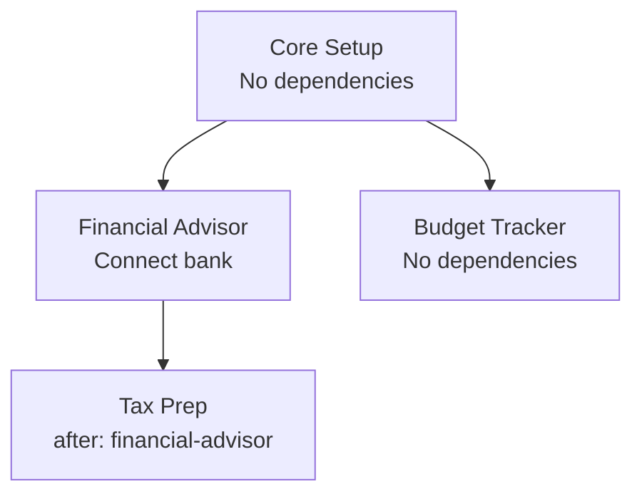

# UX Framework

> UX contracts, Svelte integration, onboarding, and responsive layout.

Source: `src/lib/praxis/ux-contracts.ts`

## Built-in UX Expectations

Radix enforces three UX expectations at runtime. These are non-negotiable — violations are errors, not warnings.

### 1. No Dead Ends (`ux-no-dead-ends`)

**Every route must be reachable from the sidebar or a parent page.**

```typescript
validate: () => {
  const routes = getAllRoutes();
  const navHrefs = new Set(getAllNavItems().map(n => n.href));
  for (const route of routes) {
    const inNav = navHrefs.has(route.path);
    const parentInNav = [...navHrefs].some(href => route.path.startsWith(href + '/'));
    if (!inNav && !parentInNav) return false;  // Unreachable route
  }
  return true;
}
```

A route passes if:
- Its path is directly in a `NavItem` href, OR
- Its path is a child of a nav item (e.g., `/financial-advisor/accounts/detail` is a child of `/financial-advisor/accounts`)

### 2. Data Prerequisites Have Empty States (`ux-data-prereqs-have-empty-states`)

**Pages with data requirements must specify what to show when data is missing.**

Every `DataRequirement` on a route must provide:
- `emptyMessage` — what to tell the user
- `fulfillHref` — where to go to fix it
- `fulfillLabel` — action button text

```typescript
interface DataRequirement {
  type: string;           // e.g., "accounts", "transactions"
  minCount?: number;      // minimum count needed (default: 1)
  emptyMessage: string;   // "No accounts yet. Add one to get started."
  fulfillHref: string;    // "/financial-advisor/accounts/new"
  fulfillLabel: string;   // "Add Account"
}
```

### 3. Nav Items Resolve (`ux-nav-items-resolve`)

**All navigation items must point to registered routes.**

No broken links in the sidebar. Every `NavItem.href` must match a registered route (or be an external URL).

Built-in routes that always exist: `/`, `/settings`, `/help`.

## Runtime Data Requirement Checking

When a user navigates to a page with `requires`, the runtime checks prerequisites:

```typescript
async function checkDataRequirements(
  requirements: DataRequirement[],
  dataCheck: (type: string) => Promise<number>,
): Promise<DataRequirement[]>  // Returns unmet requirements
```

If any requirements are unmet, the page renders an **empty state** instead of the normal component:

```
┌─────────────────────────────────┐
│                                 │
│     📊 No transactions yet      │
│                                 │
│  Import your bank statement to  │
│  get started with analysis.     │
│                                 │
│     [ Import Transactions ]     │
│                                 │
└─────────────────────────────────┘
```

The empty state is generated from the `DataRequirement` fields — plugins don't need to build their own empty state UI.

## How Plugins Declare Routes with Data Prerequisites

```typescript
const plugin: RadixPlugin = {
  id: 'financial-advisor',
  routes: [
    {
      path: '/dashboard',
      component: () => import('./pages/Dashboard.svelte'),
      title: 'Dashboard',
      requires: [
        {
          type: 'accounts',
          minCount: 1,
          emptyMessage: 'No accounts yet. Add one to see your dashboard.',
          fulfillHref: '/financial-advisor/accounts/new',
          fulfillLabel: 'Add Account',
        },
      ],
    },
    {
      path: '/analysis',
      component: () => import('./pages/Analysis.svelte'),
      title: 'Spending Analysis',
      requires: [
        {
          type: 'transactions',
          minCount: 10,
          emptyMessage: 'Need at least 10 transactions for analysis.',
          fulfillHref: '/financial-advisor/import',
          fulfillLabel: 'Import Transactions',
        },
      ],
    },
  ],
  // ...
};
```

## Onboarding Flow Sequencing

Onboarding steps are collected from all active plugins and ordered by dependency.

```typescript
interface OnboardingStep {
  title: string;                    // "Connect Your Bank"
  description: string;              // "Link your bank account to import transactions"
  icon: string;                     // "🏦"
  href: string;                     // "/financial-advisor/connect"
  actionLabel: string;              // "Connect Bank"
  isComplete: () => boolean | Promise<boolean>;  // Check if step is done
  after?: string[];                 // Plugin IDs whose steps must complete first
}
```

### Ordering Rules

1. Steps without `after` come first
2. Steps with `after` are deferred until their dependencies' steps are complete
3. Within a priority level, steps appear in plugin activation order



## Dashboard Widget Aggregation

Plugins contribute widgets to a shared dashboard via `dashboardWidgets`:

```typescript
interface DashboardWidget {
  id: string;
  title: string;
  component: () => Promise<{ default: typeof SvelteComponent }>;
  colspan?: number;    // 1-4 columns (default: 1)
  priority?: number;   // Lower = first (default: 50)
}
```

The dashboard collects all widgets via `getAllDashboardWidgets()` and renders them in a responsive grid, sorted by priority.

```
┌──────────────┬──────────────┬──────────────┬──────────────┐
│  Net Worth   │  Budget      │  Recent      │  Tax         │
│  (colspan:1) │  (colspan:1) │  Transactions│  Reminders   │
│              │              │  (colspan:1) │  (colspan:1) │
├──────────────┴──────────────┼──────────────┴──────────────┤
│  Spending Analysis          │  Cash Flow Forecast         │
│  (colspan:2)                │  (colspan:2)                │
└─────────────────────────────┴─────────────────────────────┘
```

## Settings Aggregation

All plugin settings are collected via `getAllSettings()` and rendered in a unified settings page.

Settings are organized by:
1. **Plugin** — each plugin's settings grouped together
2. **Group** — within a plugin, settings can declare a `group` for sub-organization

```typescript
interface PluginSetting {
  key: string;           // "financial-advisor.currency"
  type: SettingType;     // 'toggle' | 'select' | 'text' | 'number' | 'password' | 'color'
  label: string;
  description?: string;
  default: unknown;
  options?: { value: string; label: string }[];  // For 'select' type
  group?: string;        // Visual grouping within the plugin
}
```

## Help Section Aggregation

Plugins contribute help content via `helpSections`:

```typescript
interface HelpSection {
  title: string;
  icon: string;
  content: string | (() => Promise<{ default: typeof SvelteComponent }>);
  priority?: number;
}
```

Help content can be:
- **Markdown string** — rendered directly
- **Svelte component** — lazy-loaded for interactive help (tutorials, walkthroughs)

Sections are sorted by priority and displayed in the unified help page.

## Responsive Layout System

### Desktop (≥ 768px)

```
┌──────────┬──────────────────────────────────┐
│          │                                  │
│ Sidebar  │         Main Content             │
│          │                                  │
│ 📊 Dash  │  ┌─────────────────────────┐     │
│ 💰 Accts │  │                         │     │
│ 📈 Anlys │  │    Page Content          │     │
│ 🏷️ Tax   │  │    (plugin route)       │     │
│          │  │                         │     │
│ ── ── ── │  └─────────────────────────┘     │
│ ⚙️ Setup │                                  │
│ ❓ Help  │                                  │
│          │                                  │
└──────────┴──────────────────────────────────┘
```

### Mobile (< 768px)

```
┌──────────────────────────────────┐
│ ☰ App Name                      │
├──────────────────────────────────┤
│                                  │
│         Main Content             │
│                                  │
│  ┌─────────────────────────┐     │
│  │                         │     │
│  │    Page Content          │     │
│  │    (plugin route)       │     │
│  │                         │     │
│  └─────────────────────────┘     │
│                                  │
└──────────────────────────────────┘

☰ tap → sidebar overlay slides in
```

### Key Layout Features

- **Sidebar** aggregates all plugin nav items via `getAllNavItems()`
- **Badge counts** from `NavItem.badge()` show real-time counts (unread items, pending reviews)
- **Nested navigation** via `NavItem.children` for plugins with sub-sections
- **Breadcrumbs** set by plugins via `navigation.setBreadcrumbs()` for deep pages

## UX Validation

All UX expectations (built-in + plugin-contributed) are validated at runtime:

```typescript
async function validateUxExpectations(
  pluginExpectations?: Expectation[]
): Promise<{ id: string; description: string; severity: string }[]>
```

Returns an array of violations. In development mode, violations are surfaced as console warnings. In production, `error`-severity violations prevent the affected routes from rendering.
